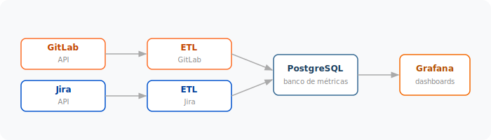

# dev-metrics

> Self-hosted engineering metrics platform — pulls data from GitLab and Jira,
> stores it in PostgreSQL and renders it in Grafana dashboards. All running
> locally via Docker Compose. *(Project documentation is in Portuguese.)*

[](https://github.com/alissonjr/dev-metrics/actions/workflows/ci.yml)
[](LICENSE)

---

Plataforma de métricas de engenharia self-hosted que coleta dados do GitLab e
do Jira e os apresenta em dashboards interativos no Grafana. Toda a
infraestrutura roda localmente via Docker Compose — não há dependências
externas pagas.

**O que você ganha:**

- Cycle time de Merge Requests, participação em code review, rework rate
- Taxa de sucesso de pipelines, deploy frequency (DORA) por projeto/ambiente
- Lead time, cycle time, action time e awaiting time por issue do Jira
- Throughput, WIP, burndown de sprint
- Logs de execução dos coletores (observabilidade do próprio ETL)

---

## Índice

1. [Arquitetura](#arquitetura)
2. [Início rápido](#início-rápido)
3. [Pré-requisitos](#pré-requisitos)
4. [Configuração](#configuração)
   - [Token GitLab](#token-gitlab)
   - [Token Jira](#token-jira)
5. [Coleta de dados](#coleta-de-dados)
6. [Dashboards disponíveis](#dashboards-disponíveis)
7. [Referência do Makefile](#referência-do-makefile)
8. [Estrutura do projeto](#estrutura-do-projeto)
9. [Contribuindo](#contribuindo)
10. [Licença](#licença)

---

## Arquitetura



Quatro serviços Docker:

| Serviço             | Container             | Função                                          |
|---------------------|-----------------------|-------------------------------------------------|
| PostgreSQL 16       | `metrics-postgres`    | Banco compartilhado pelos dois coletores        |
| GitLab ETL (Python) | `metrics-gitlab-etl`  | Coleta MRs, commits, code review, pipelines     |
| Jira ETL (Python)   | `metrics-jira-etl`    | Coleta issues, transições, sprints              |
| Grafana             | `metrics-grafana`     | Dashboards provisionados automaticamente        |

---

## Início rápido

Do zero até os dashboards funcionando em ~5 minutos:

```bash
# 1. Clone e entre no diretório
git clone https://github.com/alissonjr/dev-metrics.git
cd dev-metrics

# 2. Copie o template de configuração
cp .env.example .env

# 3. Edite o .env com seus tokens (GitLab + Jira)
${EDITOR:-vi} .env

# 4. Suba tudo
make up

# 5. Acesse o Grafana
open http://localhost:3000   # login: admin / admin
```

A coleta inicial roda em background. Acompanhe com `make logs-gitlab` e
`make logs-jira`. Dependendo do `HISTORY_DAYS` (padrão: 365), pode levar de
poucos minutos a algumas horas.

---

## Pré-requisitos

- [Docker](https://docs.docker.com/get-docker/) com Docker Compose v2
- [GNU Make](https://www.gnu.org/software/make/)
- Acesso a uma instância GitLab (self-hosted ou gitlab.com) com Personal Access Token
- Acesso ao Jira Cloud com API Token

**Instalação do Make:**

```bash
# Ubuntu / Debian
sudo apt-get install -y make

# macOS
brew install make

# Windows (Chocolatey)
choco install make
```

---

## Configuração

Copie o `.env.example` para `.env` e preencha os campos:

| Variável          | Descrição                                                |
|-------------------|----------------------------------------------------------|
| `GITLAB_URL`      | URL base do GitLab (ex: `https://gitlab.com`)            |
| `GITLAB_TOKEN`    | Personal Access Token do GitLab                          |
| `GITLAB_GROUP_ID` | ID numérico do grupo raiz no GitLab                      |
| `JIRA_URL`        | URL do Jira Cloud (ex: `https://your-team.atlassian.net`)|
| `JIRA_EMAIL`      | E-mail da conta Jira                                     |
| `JIRA_TOKEN`      | API Token do Jira                                        |
| `JIRA_PROJECTS`   | Chaves dos projetos separadas por vírgula                |

Variáveis opcionais (`SYNC_INTERVAL_HOURS`, `JIRA_SYNC_INTERVAL_HOURS`,
`HISTORY_DAYS`, `LOG_LEVEL`, `JIRA_STORY_POINTS_FIELD`,
`JIRA_ACTIVE_CATEGORIES`) estão documentadas no `.env.example`.

> **Cada coletor é independente.** Se você só usa GitLab, deixe todas as
> variáveis `JIRA_*` em branco — o container `metrics-jira-etl` vai logar
> "desativado" e dormir, sem afetar o resto da stack. O mesmo vale para o
> sentido contrário.

### Token GitLab

1. Acesse **GitLab > User Settings > Access Tokens**
   - GitLab.com: https://gitlab.com/-/user_settings/personal_access_tokens
   - Self-hosted: `https://<sua-instancia>/-/user_settings/personal_access_tokens`
2. Crie um token com escopos: `api`, `read_repository`, `read_user`
3. Copie o valor para `GITLAB_TOKEN` no `.env`

Para encontrar o `GITLAB_GROUP_ID`: abra o grupo > **Settings > General**.
O ID numérico aparece abaixo do nome.

### Token Jira

1. Acesse https://id.atlassian.com/manage-profile/security/api-tokens
2. Clique em **Create API token**, dê um nome e copie o token
3. Cole em `JIRA_TOKEN`, preencha `JIRA_EMAIL` com a conta usada
4. Liste os projetos em `JIRA_PROJECTS` (ex: `ENG,OPS,PROD`)

---

## Coleta de dados

Os coletores rodam em loop e sincronizam automaticamente:

| Serviço      | Intervalo padrão | Variável                  |
|--------------|------------------|---------------------------|
| GitLab ETL   | 6 horas          | `SYNC_INTERVAL_HOURS`     |
| Jira ETL     | 4 horas          | `JIRA_SYNC_INTERVAL_HOURS`|

```bash
make sync-gitlab    # força sync GitLab agora (reinicia o container)
make sync-jira      # força sync Jira agora
make logs-gitlab    # acompanha logs do coletor GitLab
make logs-jira      # acompanha logs do coletor Jira
```

---

## Dashboards disponíveis

| Dashboard             | URL                                           | Documentação                                     |
|-----------------------|-----------------------------------------------|--------------------------------------------------|
| GitLab Metrics        | http://localhost:3000/d/gitlab-eng-metrics    | [docs/gitlab-metrics.md](docs/gitlab-metrics.md) |
| Jira Kanban Metrics   | http://localhost:3000/d/jira-kanban-metrics   | [docs/jira-kanban.md](docs/jira-kanban.md)       |
| Jira Sprint Dashboard | http://localhost:3000/d/jira-sprint-dashboard | [docs/jira-sprint.md](docs/jira-sprint.md)       |

Cada doc descreve o que cada painel mede, como é calculado, a query SQL
utilizada e como interpretar.

---

## Referência do Makefile

| Comando            | Descrição                                              |
|--------------------|--------------------------------------------------------|
| `make help`        | Lista todos os comandos disponíveis                    |
| `make up`          | Sobe todos os serviços                                 |
| `make down`        | Para todos os serviços                                 |
| `make build`       | Reconstrói as imagens dos coletores ETL                |
| `make restart`     | Reinicia todos os serviços                             |
| `make logs`        | Logs de todos os serviços (follow)                     |
| `make logs-gitlab` | Logs do coletor GitLab                                 |
| `make logs-jira`   | Logs do coletor Jira                                   |
| `make status`      | Estado dos containers                                  |
| `make sync-gitlab` | Força sync GitLab (reinicia o container)               |
| `make sync-jira`   | Força sync Jira                                        |
| `make dump`        | Gera dump SQL do banco em `db/dump.sql`                |
| `make restore`     | Restaura o banco a partir de `db/dump.sql`             |
| `make psql`        | Shell interativo do PostgreSQL                         |

---

## Estrutura do projeto

```
.
├── .env.example            # Template de configuração
├── docker-compose.yml      # Definição dos serviços
├── Makefile                # Comandos utilitários
│
├── gitlab-etl/             # Coletor GitLab (Python)
│   ├── collector.py        # Script principal
│   ├── schema.sql          # Schema do banco (GitLab)
│   ├── db_logger.py        # Logging estruturado em DB
│   ├── requirements.txt
│   └── Dockerfile
│
├── jira-etl/               # Coletor Jira (Python)
│   ├── collector.py
│   ├── schema.sql
│   ├── db_logger.py
│   ├── requirements.txt
│   └── Dockerfile
│
├── grafana/
│   ├── dashboards/         # JSONs provisionados automaticamente
│   │   ├── Engineering/    # gitlab-metrics, jira-metrics, jira-sprint, jira-issue-list
│   │   └── Operations/     # integration-logs (observabilidade do ETL)
│   └── provisioning/       # Datasources e dashboard providers
│
├── db/
│   ├── dump.sh             # Geração de dump
│   └── restore.sh          # Restauração de dump
│
└── docs/
    ├── architecture.svg
    ├── gitlab-metrics.md
    ├── jira-kanban.md
    ├── jira-sprint.md
    └── research/           # Material de referência usado na concepção
```

---

## Contribuindo

Contribuições são bem-vindas! Algumas formas de ajudar:

- Reportar bugs e pedir features via [Issues](../../issues)
- Adicionar novos dashboards Grafana (basta um JSON em `grafana/dashboards/`)
- Estender os coletores ETL para capturar novas dimensões
- Melhorar a documentação dos dashboards em `docs/`

Antes de abrir um PR, rode os coletores localmente e confirme que os
dashboards continuam carregando sem erros.

---

## Licença

[MIT](LICENSE) — © 2026 Alisson Oliveira
